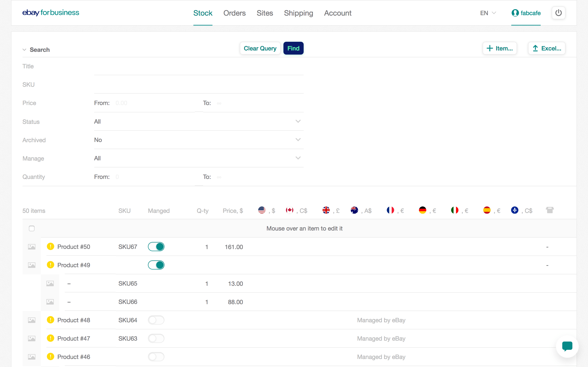
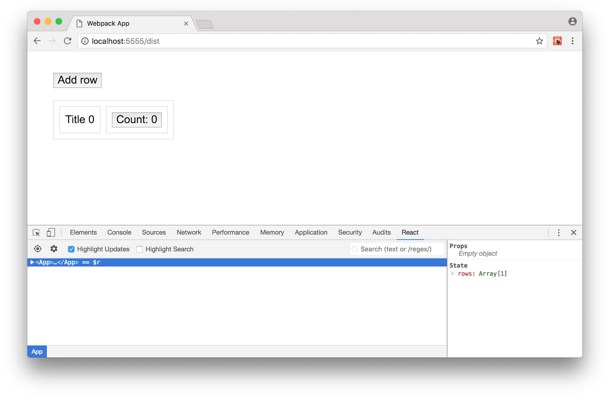
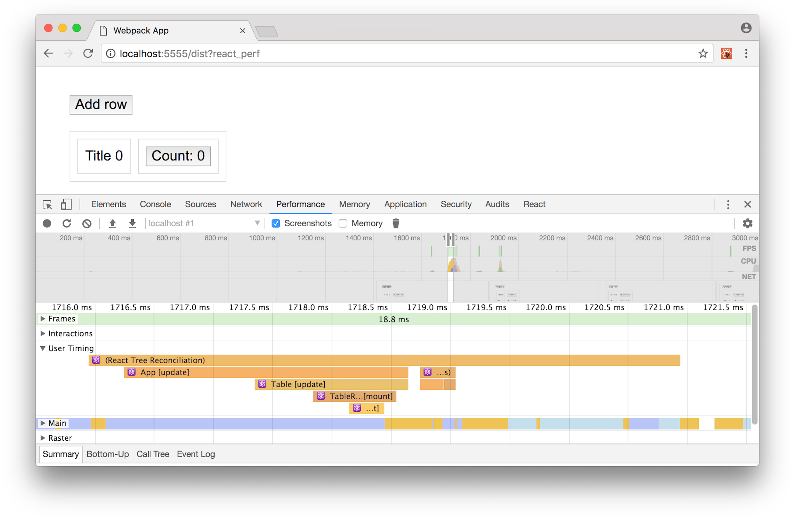

# Optimizing React: Virtual DOM explained

本文译自[《Optimizing React: Virtual DOM explained》](https://evilmartians.com/chronicles/optimizing-react-virtual-dom-explained)，来自[Evil Martians’ team](https://evilmartians.com/chronicles)团队，作者是[Alexey Ivanov](https://github.com/iAdramelk)和[Andy Barnov](https://github.com/progapandist)。

**学习一下React的Virtual DOM，使用这些知识去加速你的应用吧。这个对框架内部实现的介绍，很全面且适合初学者，我们会让JSX更加简单易懂，给你展示React如何做是否重新render的选择，解释如何找到程序的性能瓶颈，以及给大家一些如何避免常见错误的小贴士。**

React保持摇摆前端世界的原因之一，并没有显示出下降的迹象，因为它的平易近人的学习曲线：在JSX和整个“ 状态与道具 ”概念之间围绕着你的头脑之后，你很好走。

（如果您已经熟悉React的工作方式，则可以直接跳至“修复问题”）

但要真正掌握React，你需要  在React中思考。本文试图帮助你。看看我们的项目中的React表：



通过数百个动态，可过滤的行，理解框架的更精细的点对于保证顺畅的用户体验至关重要。

当事情出错时，你一定能感觉到。输入字段变得迟缓，复选框需要检查一秒钟，模态很难显示出来。

为了能够解决这些问题，我们需要涵盖React组件从您定义到在页面上呈现（然后更新）的整个过程。系好安全带！

## JSX的背后

React开发人员敦促您在编写组件时使用称为JSX的HTML和JavaScript混合。但浏览器对JSX及其语法毫无头绪。浏览器只能理解普通的JavaScript，所以JSX必须转换成它。这是一个div有一个类和一些内容的JSX代码：

（在前端圈子中称为“转译”的过程，尽管“汇编”将是一个更正确的术语。）

```jsx
<div className='cn'>
  Content!
</div>
```

“正式”JavaScript中的相同代码只是一个带有许多参数的函数调用：

```javascript
React.createElement(
  'div',
  { className: 'cn' },
  'Content!'
);
```

让我们仔细看看这些论点。第一个是一种  元素。对于HTML标签，它将是一个带有标签名称的字符串。第二个参数是一个包含所有元素属性的对象  。如果没有，它也可以是空的对象。以下所有参数都是元素的子元素。元素中的文本也算作一个孩子，所以字符串'Content！' 作为函数调用的第三个参数放置。

你可以想象当我们有更多的children时会发生什么：

```jsx
<div className='cn'>
  Content 1!
  <br />
  Content 2!
</div>
```

```javascript
React.createElement(
  'div',
  { className: 'cn' },
  'Content 1!',              // 1st child
  React.createElement('br'), // 2nd child
  'Content 2!'               // 3rd child
)
```

我们的函数现在有五个参数：一个元素的类型，一个属性对象和三个子元素。因为我们的一个孩子也是一个React已知的HTML标签，所以它也会被描述为一个函数调用。

到目前为止，我们已经涵盖了两种类型的孩子：简单的`String`或另一种呼叫`React.createElement`。但是，其他值也可以作为参数：

* 基元`false, null, undefined`和`true`
* 数组
* 反应组件

使用数组是因为可以将children分组并作为一个参数传递：

```javascript
React.createElement(
  'div',
  { className: 'cn' },
  ['Content 1!', React.createElement('br'), 'Content 2!']
)
```

当然，React的威力不是来自HTML规范中描述的标签，而是来自用户创建的组件，例如：

```javascript
function Table({ rows }) {
  return (
    <table>
      {rows.map(row => (
        <tr key={row.id}>
          <td>{row.title}</td>
        </tr>
      ))}
    </table>
  );
}
```

组件允许我们将我们的模板分解为可重用的块。在上面的“功能”组件的例子中  ，我们接受一个包含表格行数据的对象数组，并返回`React.createElement`一个`<table>`元素及其行作为子元素的单个调用。

无论何时我们将组件放入如下的布局中：

```jsx
<Table rows={rows} />
```

从浏览器的角度来看，我们写道：

```javascript
React.createElement(Table, { rows: rows });
```

请注意，这次我们的第一个参数不是`String`描述HTML元素，而是对我们在编写组件时编写的函数的引用。我们的属性现在是我们的`props`。

## 将组件放在页面上

所以，我们已经将所有JSX组件转换为纯JavaScript，现在我们有一大堆函数调用，其参数是其他函数调用，还有其他函数调用......它们如何转换为形成网页的DOM元素？

为此，我们有一个`ReactDOM`库及其`render`方法：

```javascript
function Table({ rows }) { /* ... */ } // defining a component

// rendering a component
ReactDOM.render(
  React.createElement(Table, { rows: rows }), // "creating" a component
  document.getElementById('#root') // inserting it on a page
);
```

当`ReactDOM.render`被调用时，`React.createElement`最终调用它并返回以下对象：

```javascript
// There are more fields, but these are most important to us
{
  type: Table,
  props: {
    rows: rows
  },
  // ...
}
```

***

**这些对象在React的意义上构成了虚拟DOM。**

***

他们将在所有进一步的渲染中相互比较，并最终转化为  真正的`DOM`（而不是虚拟的）。

下面是另一个例子：这次div有一个类属性和几个children：

```javascript
React.createElement(
  'div',
  { className: 'cn' },
  'Content 1!',
  'Content 2!',
);
```

变成：

```javascript
{
  type: 'div',
  props: {
    className: 'cn',
    children: [
      'Content 1!',
      'Content 2!'
    ]
  }
}
```

需要注意的是谁曾经是单独的参数传递给孩子  `React.createElement`的功能有一个下找到自己的位置`children`里面的关键`props`。因此，无论children是作为数组还是参数列表传递都无关紧要 - 在生成的虚拟DOM对象中，无论如何它们都会一起结束。

更重要的是，我们可以直接在JSX代码中将孩子添加到道具中，结果仍然是一样的：

```jsx
<div className='cn' children={['Content 1!', 'Content 2!']} />
```

在构建虚拟DOM对象后，`ReactDOM.render`将尝试将其转换为我们的浏览器可以根据这些规则显示的DOM节点：

* 如果一个`type`属性包含一个带有标签名称的字符串 - 创建一个标签，其中列出所有属性`props`。

* 如果我们有一个函数或一个类，`type`调用它并对结果递归地重复这个过程。

* 如果有任何`children`下`props`-repeat由父的DOM节点内一个和地方的结果给每个child一个过程。

因此，我们得到以下HTML（对于我们的表格示例）：

```html
<table>
  <tr>
    <td>Title</td>
  </tr>
  ...
</table>
```

## 重新构建DOM

请注意，标题中的“重新”！当我们想更新一个页面而不是全部替换时，React中的真正魔法就开始了。我们如何实现它的方法很少。我们先从最简单的一次调用`ReactDOM.render`同一节点开始。

```javascript
// Second call
ReactDOM.render(
  React.createElement(Table, { rows: rows }),
  document.getElementById('#root')
);
```

这一次，上面的代码将表现与我们已经看到的不同。React将从头开始创建所有DOM节点并将其放在页面上，而不是从头开始创建所有DOM节点，React将启动`调节`（或“差异化”）算法，以确定节点树的哪些部分必须更新，哪些可以保持不变。

那么它是怎样工作的？只有少数简单的场景，  理解它们将对我们的优化帮助很大。请记住，我们现在正在查看用作React虚拟DOM中节点表示的对象。

### 情况1：`type`是一个字符串，`type`在通话中保持不变，`props`也没有改变。

```javascript
// before update
{ type: 'div', props: { className: 'cn' } }

// after update
{ type: 'div', props: { className: 'cn' } }
```

这是最简单的情况：DOM保持不变。

### 场景2：`type`仍然是相同的字符串，`props`是不同的。

```javascript
// before update:
{ type: 'div', props: { className: 'cn' } }

// after update:
{ type: 'div', props: { className: 'cnn' } }
```

由于我们`type`仍然代表HTML 元素，因此React知道如何通过标准DOM API调用来更改其属性，而无需从DOM树中删除节点。

### 方案3：`type`已更改为不同的`String`或从`String`组件。

```javascript
// before update:
{ type: 'div', props: { className: 'cn' } }

// after update:
{ type: 'span', props: { className: 'cn' } }
```

由于React现在认为类型不同，它甚至不会尝试更新我们的节点：old元素将与其所有子节点一起被删除（卸载）。因此，将元素替换为完全不同于DOM树的东西可能会非常昂贵。幸运的是，这在现实世界中很少发生。

记住React使用`===`（triple equals）来比较`type`值是很重要的，所以它们必须是相同类或相同函数的相同实例。

下一个场景更加有趣，因为我们经常使用React。

### 场景4：type是一个组件。

```
// before update:
{ type: Table, props: { rows: rows } }

// after update:
{ type: Table, props: { rows: rows } }
```

***

“但是没有任何变化！”，你可能会说，你会错的。

***

如果`type`是对函数或类的引用（即您的常规React组件），并且我们启动了树对齐过程，则React将始终尝试查看组件内部以确保返回的值  `render`不会更改（排序预防副作用）。对树中的每个组件进行冲洗和重复 - 是的，复杂的渲染可能会变得很昂贵！

## 关注children的情况

除了上述四种常见情况之外，当元素有多个子元素时，我们还需要考虑React的行为。假设我们有这样一个元素：

```javascript
// ...
props: {
  children: [
      { type: 'div' },
      { type: 'span' },
      { type: 'br' }
  ]
},
// ...
```

我们想要交换这些children：

```javascript
// ...
props: {
  children: [
    { type: 'span' },
    { type: 'div' },
    { type: 'br' }
  ]
},
// ...
```

然后会发生什么？

如果在“差异”的同时，React看到里面的任何数组`props.children`，它就会开始比较它中的元素与之前看到的数组中的元素，方法是按照顺序查看它们：索引0将与索引0进行比较，索引1索引为1，等等。对于每一对，React将应用上述规则集。在我们的例子，它认为`div`成为一个`span`如此情景3将被应用。这不是非常高效：假设我们已经从1000行表中删除了第一行。React将不得不“更新”剩余的999个子项，因为与先前的按索引表示索引相比，它们的内容现在不会相同。

幸运的是，React有一个`内置的方法`来解决这个问题。如果一个元素有一个`key`属性，那么元素将被一个值而 `key`不是索引来比较。只要键是唯一的，React就会移动元素而不将它们从DOM树中移除，然后将它们放回（在React中以挂载/卸载方式已知的过程）。

```javascript
// ...
props: {
  children: [ // Now React will look on key, not index
    { type: 'div', key: 'div' },
    { type: 'span', key: 'span' },
    { type: 'br', key: 'bt' }
  ]
},
// ...
```

## 状态发生变化时

到目前为止，我们只是触及了`propsReact`哲学的一部分，却忽视了这一点`state`。这是一个简单的“有状态”组件：

```javascript
class App extends Component {
  state = { counter: 0 }

  increment = () => this.setState({
    counter: this.state.counter + 1,
  })

  render = () => (<button onClick={this.increment}>
    {'Counter: ' + this.state.counter}
  </button>)
}
```

所以，我们有一个`counter`关键在我们的状态对象。点击按钮可增加其值并更改按钮文本。但是当我们这样做时，DOM中会发生什么？哪部分将被重新计算和更新？

调用`this.setState`也会导致重新渲染，但不会影响整个页面，而只会影响组件本身及其子项。父母和兄弟姐妹都幸免于难。当我们有一棵大树时，这很方便，我们只想重绘它的一部分。

## 确定问题

我们准备了一个[小型演示应用程序](https://iadramelk.github.io/optimizing-react-demo/dist/before.html)，以便在解决它们之前，您可以在野外看到最常见的问题。你可以在[这里](https://github.com/iAdramelk/optimizing-react-demo)看看它的源代码。您还需要[React Developer Tools](https://github.com/facebook/react-devtools)，因此请确保您的浏览器已安装了它们。

我们首先要看看哪些元素以及何时导致虚拟DOM被更新。在浏览器的开发工具中导航到React面板并选择“Highlight Updates”复选框：



现在尝试在表格中添加一行。如您所见，页面上的每个元素周围都会显示一个边框。这意味着每次添加一行时，React都在计算和比较整个虚拟DOM树。现在尝试点击一行内的计数器按钮。您将看到虚拟DOM如何更新 - `state`仅关注相关元素及其子项受到影响。

React DevTools会提示问题出在哪里，但不会告诉我们有关细节的信息：特别是所涉及的更新是指“区分”元素还是挂载/卸载它们。要了解更多信息，我们需要使用React的内置[分析器](https://reactjs.org/docs/optimizing-performance.html#profiling-components-with-the-chrome-performance-tab)（注意它不适用于生产模式）。

添加`?react_perf`到您应用的任何网址，然后转到Chrome DevTools中的“效果”标签。点击录制按钮并在桌子上点击。添加一些行，更改一些计数器，然后点击“停止”。



在结果输出中，我们对“用户计时”感兴趣。放大时间轴直到看到“React Tree Reconciliation”组及其子项。这些是我们组件的所有名称，它们旁边都有[update]或  [mount]。

***

我们的大部分性能问题都属于这两类问题之一。

***

无论是组件（还是从它分支的所有东西）出于某种原因都会在每次更新时重新安装，并且我们不希望它（重新安装很慢），或者我们正在大型分支上执行昂贵的对帐，即使没有已经改变。

## 修理我的代码：Mounting / Unmounting

现在，当我们抓住一些有关React如何决定更新虚拟DOM并理解如何看到幕后发生的事情的理论时，我们终于准备好解决问题了！首先，我们来处理坐骑/卸载。

如果仅仅介意任何元素/组件的多个子元素在内部表示为数组，则可以获得显着的速度提升  。

考虑这个：

```jsx
<div>
  <Message />
  <Table />
  <Footer />
</div>
```

在我们的虚拟DOM中，将表现为：

```javascript
// ...
props: {
  children: [
    { type: Message },
    { type: Table },
    { type: Footer }
  ]
}
// ...
```

我们有一个简单的`Message`例子，就是`div`持有一些文本（想想你的花园种类通知）和一个巨大的`Table`跨越，比方说，超过1000行。它们都是封闭的子节点`div`，所以它们被放置在`props.children`父节点的下面，并且它们不会碰巧有一个键。React甚至不会提醒我们通过控制台警告分配键，因为儿童正在`React.createElement`作为参数列表传递给父代，而不是数组。

现在我们的用户已经解散了一个通知并  `Message`从树上移除。`Table`并且`Footer`都是剩下的。

```javascript
// ...
props: {
  children: [
    { type: Table },
    { type: Footer }
  ]
}
// ...
```

React如何看待它？它把它看作是一系列不断变化的儿童：`children[0]`举行一个`Message`，现在它成立`Table`。没有比较的关键字，所以它比较`types`，并且因为它们都是对函数（和不同函数）的引用，所以它卸载整个`Table`并重新装载它，呈现其所有子项：超过1000行！

因此，您可以添加唯一的键（但在这种特殊情况下，使用键并不是最佳选择），或者采用更智能的技巧：使用[短路布尔评估](https://developer.mozilla.org/en-US/docs/Web/JavaScript/Reference/Operators/Logical_Operators)，这是JavaScript和许多其他现代语言的特性。看：

```jsx
// Using a boolean trick
<div>
  {isShown && <Message />}
  <Table />
  <Footer />
</div>
```

即使`Message`不在图片中，`props.children`父母`div`仍然会拥有三个元素，`children[0]`具有一个值`false`（一个布尔原语）。请记住`true/ false，null`并且`undefined`是虚拟DOM对象type属性的所有允许值，我们最终得到了类似的结果：

```javascript
// ...
props: {
  children: [
    false, //  isShown && <Message /> evaluates to false
    { type: Table },
    { type: Footer }
  ]
}
// ...
```

因此，`Message`我们的索引不会改变，`Table`当然，它仍然会被比作`Table`（`type`无论如何都会引用组件），但仅仅比较虚拟DOM通常比删除DOM节点并从中创建它们快得多再次划伤。

现在我们来看看更多进化的东西。我们知道你喜欢HOC。高阶组件是一个将组件作为参数，执行某些操作并返回不同功能的函数：

```javascript
function withName(SomeComponent) {
  // Computing name, possibly expensive...
  return function(props) {
    return <SomeComponent {...props} name={name} />;
  }
}
```

这是一种非常常见的模式，但您需要小心。考虑：

```javascript
class App extends React.Component() {
  render() {
    // Creates a new instance on each render
    const ComponentWithName = withName(SomeComponent);
    return <SomeComponentWithName />;
  }
}
```

我们在父母的`render`方法内部创建一个HOC 。当我们重新渲染树时，我们的虚拟DOM将如下所示：

```javascript
// On first render:
{
  type: ComponentWithName,
  props: {},
}

// On second render:
{
  type: ComponentWithName, // Same name, but different instance
  props: {},
}
```

现在，React很乐意运行差异化算法  `ComponentWithName`，但由于此时同名引用了  不同的实例，因此三等于比较失败，而不是调整，必须发生完全重新安装。注意它也会导致状态丢失，[如此处所述](https://github.com/facebook/react/blob/044015760883d03f060301a15beef17909abbf71/docs/docs/higher-order-components.md#dont-use-hocs-inside-the-render-method)。幸运的是，这很容易解决：您需要始终创建一个HOC  render：

```javascript
// Creates a new instance just once
const ComponentWithName = withName(Component);

class App extends React.Component() {
  render() {
    return <ComponentWithName />;
  }
}
```

## 修理我的代码：Updating

所以，现在我们确保不重新安装东西，除非必要。但是，对位于DOM树根部附近的组件所做的任何更改都会导致其所有子级的差异和调和。结构复杂，昂贵且经常可以避免。

***

有一种方法可以告诉React不要看看某个分支，因为我们确信它没有变化。

***

这种方式存在，它涉及一个方法`shouldComponentUpdate`，它是[组件生命周期](https://reactjs.org/docs/react-component.html#the-component-lifecycle)的一部分  。在每次调用组件`render`并接收道具和状态的新值之前调用此方法 。然后我们可以自由地将它们与我们当前的值进行比较，并决定是否更新我们的组件（返回`true`或`false`）。如果我们返回`false`，React将不会重新渲染组件，也不会查看其子组件。

通常要比较两个集合`props`和`state`一个简单的浅层比较就足够了：如果顶层的值不同，我们不必更新。浅比较不是JavaScript的一个特性，但有很多[实用程序](https://github.com/dashed/shallowequal)。

在他们的帮助下，我们可以像这样编写我们的代码：

```javascript
class TableRow extends React.Component {

  // will return true if new props/state are different from old ones
  shouldComponentUpdate(nextProps, nextState) {
    const { props, state } = this;
    return !shallowequal(props, nextProps)
           && !shallowequal(state, nextState);
  }

  render() { /* ... */ }
}
```

但是你甚至不需要自己编写代码，因为React的这个特性内置在一个  名为`class`的类中 `React.PureComponent`。它类似于  `React.Component`，只是`shouldComponentUpdate`已经为你实施了一个浅的道具/状态比较。

这听起来像是一个不容小觑的想法，只是在班级定义的  部分交换`Component`，并享受高效率。虽然不是很快！考虑这些例子：`PureComponentextends`。

```jsx
<Table
    // map returns a new instance of array so shallow comparison will fail
    rows={rows.map(/* ... */)}
    // object literal is always "different" from predecessor
    style={ { color: 'red' } }
    // arrow function is a new unnamed thing in the scope, so there will always be a full diffing
    onUpdate={() => { /* ... */ }}
/>
```

上面的代码片段演示了三种最常见的反模式。尽量避免它们！

***

如果您注意在render定义之外创建所有对象，数组和函数，  并确保它们在调用之间不发生更改 - 您是安全的。

***

你可以观察到的效应  `PureComponent`在[更新的演示](https://iadramelk.github.io/optimizing-react-demo/dist/after.html)，所有表的Rows为“净化”。如果您在React DevTools中打开“Highlight Updates”，您会注意到只有表格本身和新行在行插入时呈现，所有其他行保持不变。

不过，如果你迫不及待地  全力以赴在纯组分和你到处实现他们的应用程序，阻止自己。比较两组`props`和`state`不是免费的，对于大多数基本组件来说甚至都不值得：`shallowCompare`比差异算法需要更多的时间来运行。

使用这个经验法则：纯组件适用于复杂的表单和表格，但它们通常会减慢按钮或图标等简单元素的速度。

***

感谢您的阅读！现在您已准备好将这些见解应用到您的应用程序中。您可以使用我们的小演示（[用了](https://iadramelk.github.io/optimizing-react-demo/dist/after.html)或[没有用](https://iadramelk.github.io/optimizing-react-demo/dist/before.html)PureComponent）的[仓库](https://github.com/iAdramelk/optimizing-react-demo)作为您的实验的起点。此外，请继续关注本系列的下一部分，我们计划涵盖Redux并优化您的数据以提高应用程序的总体性能。